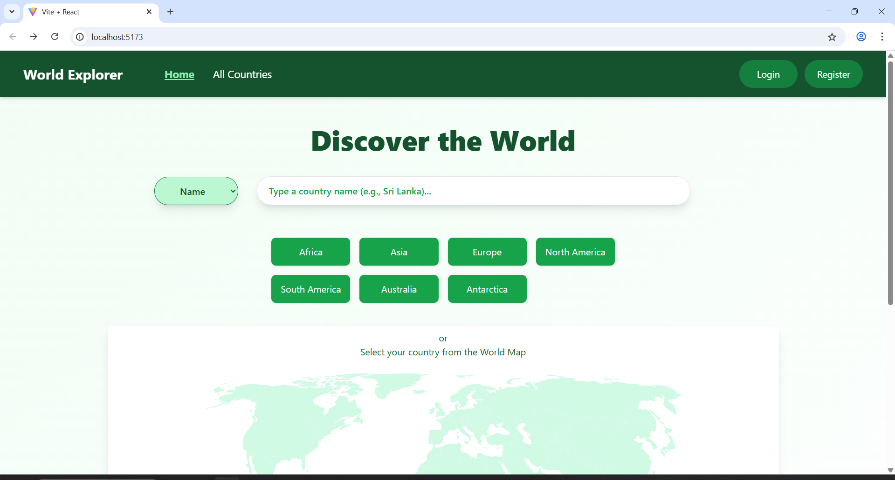
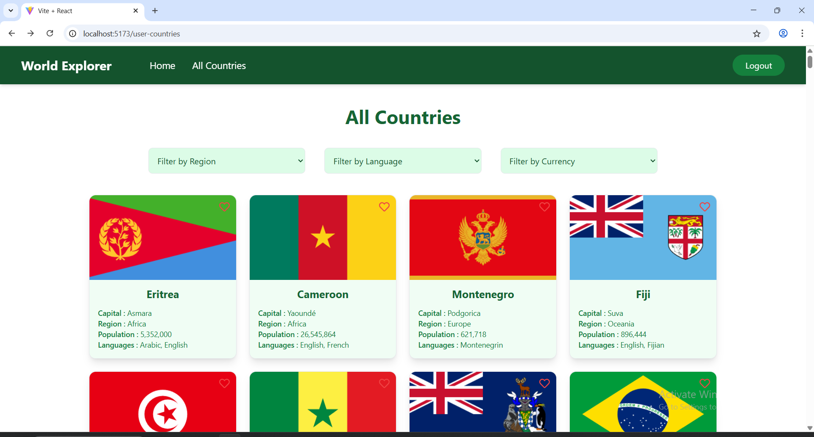
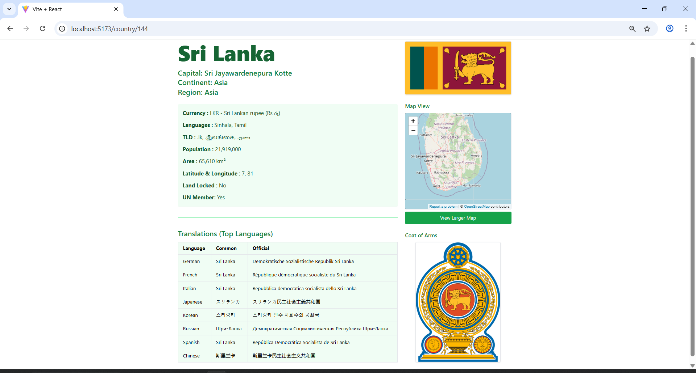

# World Explorer

World Explorer is a full stack web application that allows users to explore countries worldwide through dynamic search, filtering and detailed views. Features responsive design, API integration, testing  and deployment with Git‑based version control.

* **Frontend:** React + Tailwind CSS
---



---



---




## Build & Deployment Instructions

### Used APIs
- https://restcountries.com/v3.1/all
- https://restcountries.com/v3.1/alpha/${code}
- https://restcountries.com/v3.1/alpha/${region}
- https://restcountries.com/v3.1/currency/${currency}
- https://restcountries.com/v3.1/capital/${capital}


## Testing

The project includes comprehensive unit and integration tests for both the frontend and backend.

### Frontend Testing

- **Tools:** Jest + React Testing Library
- 
- **Coverage:**
  - Component tests for:
    - HomePage
    - DashboardPage
    - CountryList
    - CountryDetails
    - 
- **How to Run:**
```bash
cd rest-countries-app
npm test             
npm test CountryList 
```
